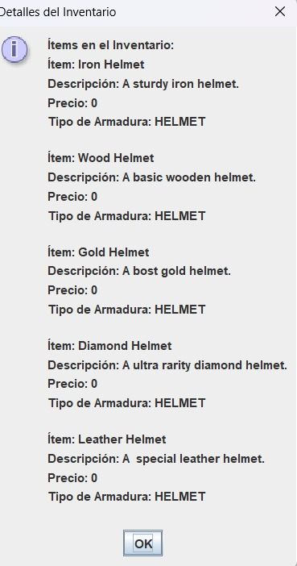

# rpg.java
trabajo del rpg equipo 1

Se añadió el método setArmor en la clase Player para gestionar la equipación de armaduras. Este método verifica si la armadura es equipable, actualiza las estadísticas de defensa del jugador al equipar o desequipar armaduras y muestra mensajes informativos al usuario sobre el estado del equipamiento.
Mejora en la Lógica de Equipamiento:

Se implementó una verificación que previene que el jugador equipe la misma armadura varias veces, mostrando un mensaje adecuado ("El jugador ya tiene equipado [nombre del ítem]") en lugar de permitir un equipamiento redundante.
Cálculos de Daño Mejorados:

Se revisó la lógica para calcular el daño infligido tanto por el jugador como por los enemigos, teniendo en cuenta la defensa del oponente. Esto asegura que el daño refleje adecuadamente las estadísticas de ataque y defensa.
Pruebas de Funcionamiento:

Se realizaron pruebas del sistema de inventario y equipamiento, confirmando que las estadísticas del jugador se aplican correctamente durante los combates, y que los cambios de equipamiento se reflejan en el daño recibido y causado.

Se adjuntan capturas del test de inventario

